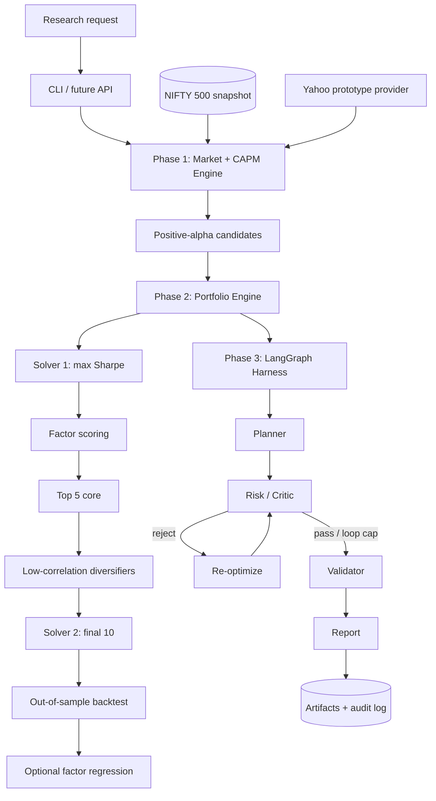

# QUANTA System Design — Phases 1–3

## 1. Design rule

**Agents reason. Tools calculate. The harness controls. Validators verify. Humans approve.**

The LLM is never the source of portfolio weights, beta, CAPM values, covariance, Sharpe ratios, or backtest metrics. Those are produced by deterministic Python functions.

## 2. Component architecture

## 3. Data flow and anti-bias controls

A dated constituent snapshot is the research universe input. The provider can enrich missing market caps. For serious historical studies, the snapshot must correspond to the historical decision date; using today's survivors for an old backtest introduces survivorship/look-ahead bias.

Returns are split chronologically: the earlier sample is used for CAPM, covariance, scoring inputs derived from prices, and optimization; the later sample is reserved for validation. No random train/test split is used.

## 4. Phase 1

1. Load ~500 NIFTY 500 symbols.
2. Enrich missing company metadata/market caps.
3. Rank by market cap; retain top 50 + bottom 50.
4. Fetch adjusted prices plus benchmark.
5. Calculate returns and chronological train/test split.
6. Estimate OLS beta on excess returns.
7. Compute CAPM required return and the separate CAPM screening alpha.
8. Export SML and candidates.

## 5. Phase 2

Solver 1 maximizes ex-ante Sharpe under long-only, fully-invested, max-weight constraints. Its largest positive-weight candidates feed a seven-factor score. Missing factor values are neutral rather than silently becoming zero-quality scores.

Top-scoring names become core holdings. Diversifiers are selected from the wider selected universe by low absolute average correlation with the core. Solver 2 re-optimizes the final set and can enforce a minimum core weight. Validation uses the held-out return period.

## 6. Phase 3

LangGraph is the workflow state machine. Nodes are intentionally narrow:

- Planner: declares research-review stages; optional LLM prose only.
- Risk/Critic: deterministic policy checks.
- Reoptimizer: deterministic constrained optimization with tightened concentration policy.
- Validator: deterministic validation status.
- Reporter: final Markdown research record.

All transitions are logged to `audit.jsonl`. Reoptimization is capped, preventing uncontrolled loops.

## 7. Security / governance

- Research-only; no brokerage/execution connector.
- No credentials committed to Git.
- Tool permission surface is documented in `tools/registry.py`.
- Deterministic calculations remain independently testable.
- Every run has a unique run ID and artifact folder.
- Data-provider results are cached locally for repeatability, but formal research should archive licensed point-in-time datasets.
